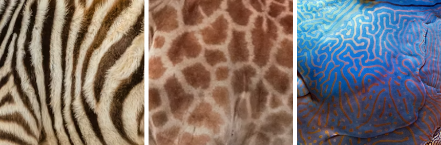
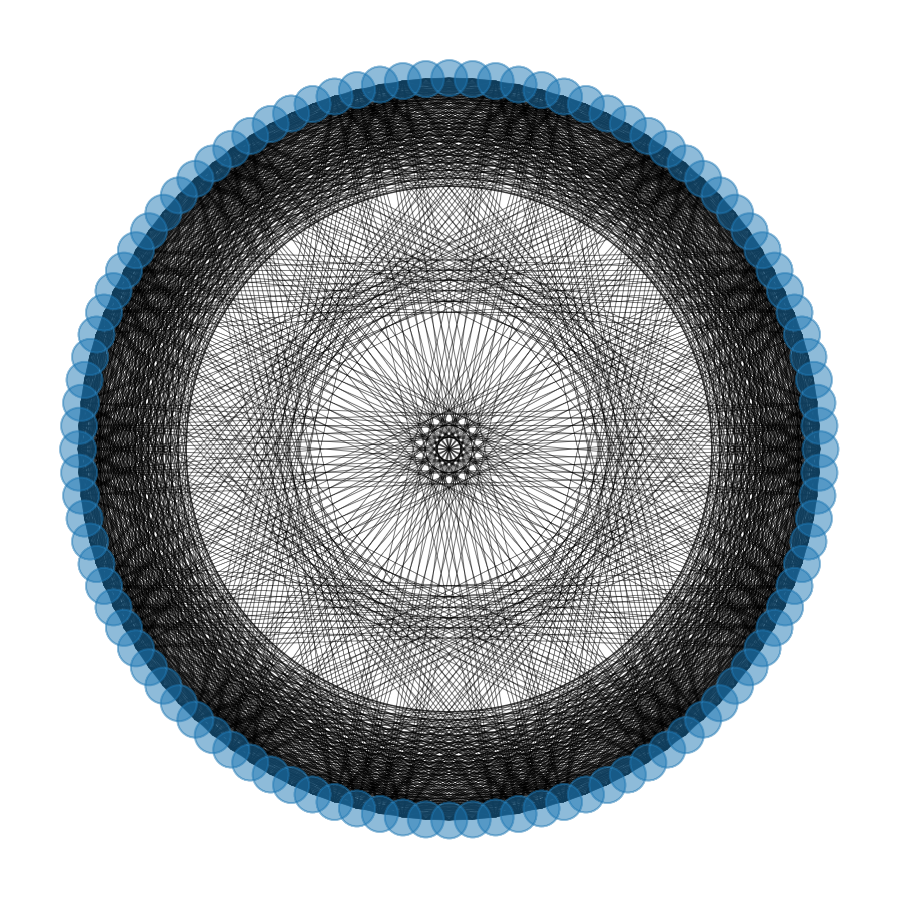

---
### The goal
Explain my mathematics thesis in a way that
1. is easy to understand
2. shows how we can use math to tackle some real-world problems
3. explains the connection between zebra stripes, brains, and patchy habitats 

If you are interested in reading the original version you can find it [here](../assets/pdfs/dissertation.pdf){:target="_blank"}, but
my hope is that this post is much more digestible, albeit less detailed and marginally less precise. 

---
# Topology Mediated Network Turing Patterns
We'll start with Alan Turing (aka the goat). Though he is perhaps most famous for cracking German ciphers during WWII, Turing was prolific across a number of areas in mathematics and theoretical computer science. Turing had a particular interest in how patterns form in the animal kindom---how do zebras develop stripes? Why do giraffes have splotches[^a]? Where do fish patterns come from? In general, Turing was interested in *morphogenesis*---the process by which biological organisms develop patterns and shapes. 

To answer this question, he (unsurprisingly) turned to mathematics. He proposed modeling the problem as a *reaction-diffusion system*, publishing his theory in a 1952 paper called "The Chemical Basis of Morphogenesis." Though he didn't quite nail all of the biological details, the mathematics describing these eponymous Turing patterns still checks out.

{:class="pattern-examples"}

## Zebra Stripes
We'll use the example of zebra stripes to illustrate some of the basic concepts. Imagine we have two kinds of chemicals: chemical A, responsible for white stripes, and chemical B, responsible for black stripes. Let's say that initially, these chemicals are found in approximately equal concentrations across a zebra's coat. More generally, we can say the chemicals are *uniformly distributed* across a surface area of interest. We make two key assumptions:
1. The chemicals are moving around (i.e. diffusing)
2. The chemicals are interacting with each other (i.e. reacting)

Put these two assumptions together---boom, you have a reaction-diffusion system! If we define the dynamics of this system mathematically and simulate what happens to the chemicals over time, we can observe whether or not patterns emerge. Alright, now let's get back to the zebras. 

Suppose I slightly perturb the initial distribution of chemicals A and B and run a simulation on the system to see if we get zebra stripes. Intuitively, if my perturbation was small enough, I wouldn't expect any patterns to emerge, as there would still be an approximately equal amount of chemical A and chemical B at every point; however, as Turing showed, this is not always the case. Under certain conditions[^b], even an extremely small perturbation will give us zebra stripes: high concentrations of chemical A in some parts (aka the white stripes) and high concentrations of chemical B in other parts (aka the black stripes). Short of getting into the details of the mathematical conditions under which this can occur, that's really all there is to it---now we have a framework for helping us understand how patterns seemingly spontaneously emerge from uniform initial conditions. 

## Brains and Patchy Habitats

There's no reason why we have to restrict ourselves to just describing animal patterns. In general, we want to study some set of "stuff" moving around and reacting in some defined space, with a particular interest in pattern formation. In the previous example, our "stuff" was chemicals and our space was a zebra's coat, but why not go bigger? Why not study galactal formations in literal space? Or why not go smaller? Why not study bismuth crystallization in nanospaces? Spoiler: you can (and people have) done both of these!

We can really run with this whole generalizability thing and make two key abstractions to show why this matters in the real world. First, we can expand[^c] the notion of space to include network structures, and second, we can abstract the idea of what constitutes a pattern. 

The zebra example took for granted the idea of continuity---because the surface is continuous, you could choose any spot on a zebra's coat and measure the concentration of chemicals A and B. This is not always the case, as we sometimes might be interested in discrete structures, where we can't continuously move from one point to any other point in target area. Think of crossing a river---the continuous case is like swimming across through the water, where your entire path is smoothly connected. The discrete case is like jumping from rock to rock to get to the other side, where no two rocks are physically connected and (unless you can float in midair), you don't hangout in between successive rocks. 

A network is a type of discrete structure. Formally, a network is a set of nodes, wherein nodes are connected to each other via some set of edges. For social networks, we can imagine these nodes as people, while edges represent some kind of relationship connecting two people. In biology, a network might be a collection of cells (nodes) and cell signaling pathways (edges), or in international trade we might have countries (nodes) connected via trade routes (edges). In short, network structures are everywhere if you know where to look. And what's even more omnipresent than networks? Hint: it starts with 'p' and rhymes with 'batterns'[^d]. Yup, it's patterns. 

Are we about to do yet another illustration via example? You betcha. Imagine we are studying how an illness propagates via a social network. We have some "stuff" (germs, viruses, etc) diffusing and reacting in a space (the social network). We might notice that certain "stripes" or "circles" of the population tend to get sick, while different "stripes" or "circles" of the population appear to be immune. You might already see where I am going with this---we can think of this as a pattern! It might not be as visually appealing as the patterns found on the Humphead Wrasse, but this "sick/healthy" pattern is not only mathematically valid, it describes a potentially high-stakes real-world use-case[^f]. 

If you aren't convinced yet, let me provide two additional examples: brain networks and predator-prey dynamics. In some sense, we can think of the brain as an interconnected network of neurons, with tons of interesting "stuff" moving around and reacting in this network (neurotransmitters, blood, nutrients, etc). And in some very different sense, we can think of certain biomes as interconnected networks of "patchy" habitats[^e], wherein predator and prey species move about and interact in this space. In both cases, I think the point is made quite clear without explicitly detailing potential patterns of interest---high-stakes network structures engender high-stakes patterns.

## Can we control the emergence of patterns?

The previous sections laid out some fundamentals, but most importantly motivated the idea of desirable and undesirable patterns. In the epidemiology case, our desired pattern is obviously one in which the population is healthy, while the undesirable pattern is the opposite. So, this instigates the natural question: how can we induce desirable and prevent undesirable patterns?

In my dissertation, I take this question a bit further and focus on networks. Specifically, I ask if we can change the structure (topology) of a network to mediate pattern formation, hence the title of my work, "Topology Mediated Network Turing Patterns." Why did I choose to focus on network topology? Because many real-world interventions can be mapped to changes in network structure. In the epidemiology case, we might change the way disease can flow across a network of people through vaccination campaigns or quarantines; in brain networks, the flow of neurotransmitters may be hindered by a traumatic injury or bolstered by rewiring as a consequence of brain plasticity; in predator/prey dynamics, a network of patchy habitats may be changed by the flooding of a land-bridge or other natural disaster. All of these structural changes have the capacity to affect patterns, so it makes sense to question whether we can do this intentionally to control pattern formation. 

So, can we? 

In short, the answer is yes, but it's really hard to do it precisely and deterministically. In the latter portion of my dissertation, I outline some theoretical expectations for why this is the case on a specific type of network (a ring lattice), then simulate some results to show how we would actually have to re-structure a network to induce patterns. In the process, I ended up with some beautiful visualizations, so I have included one of my favorites below[^g]. 

{:class="re-wired-network"}

So there you have it! A quick tour of my dissertation, starting with Alan Turing and finishing with a pretty picture of a network, with a brief stop for zebras, brains, and patchy habitats along the way.

I care deeply about my work, and in turn, communicating my work to the world. If you have any feedback, questions, or just want to chat about anything I have written here, don't hesitate to reach out. 

---

[^a]: Open to ideas for a better term to use instead of the super technical "splotch."
[^b]: By conditions, I am referring to the details regarding how we define the diffusion and reaction dynamics. For instance, we require a certain ratio of diffusion coefficients for Turing instability to even be possible, or particular distributions of eigenvalues of the matrix Laplacian when working with networks. 
[^c]: or restrict, depending on how you look at it.
[^d]: I could have chosen a real word here, like Saturn, but we leaned into the galactal theme once already. 
[^e]: When I say patchy here, I implicitly claim that it is valid to approximate a network of habitated areas as a discrete network, given that species of interest only use network "edges" as a mode of transit (rather than a consistently habitated area). There is a somewhat valid counterargument that we should treat this system as continuous, but any further discussion gets into some mathematical debates. Suffice to say the discrete case is a great approximation for our use case. 
[^f]: How many hyphenated words can I use in a row? 
[^g]: It took me *ages* to figure out why the results look like this. And by look like this, I mean beautifully symmetric with some unexpected regularity. The answer---roots of unity!