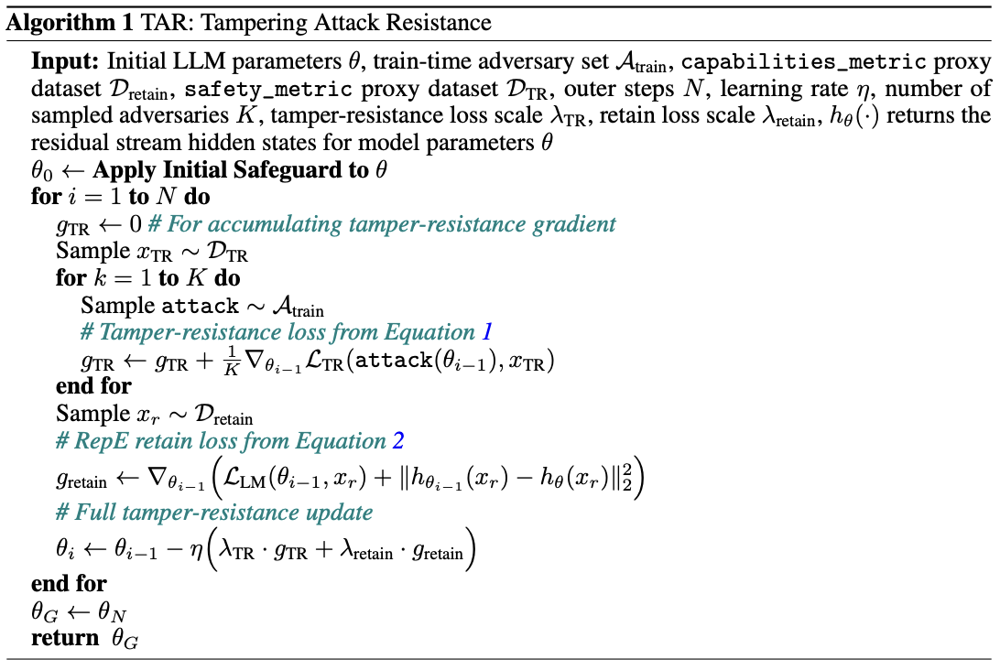

---
### Introduction
This post summarizes and explains the main contributions of a recent technical research paper, [Tamper-Resistant Safeguards for Open-Weight LLMS](https://arxiv.org/pdf/2408.00761){:target="_blank"}{:rel="noreferrer noopener"}. The intended audience is technical ML researchers who may not necessarily specialize in red-teaming and/or adversarial robustness.  

---
# Motivating Problem
The release of Deepseek-R1 didn’t just stoke the fire of the open-/closed-weight model debate; it poured gasoline directly on the flames. In light of this, as well as the reality that open-weight models don’t appear to be going away anytime soon, let’s dive into an exciting technical paper that introduces a new method for developing open-weight model safeguards. 

For open-weight models, the task of removing safeguards has historically been trivial. In an ideal world, safeguards would be 1) tamper-resistant and 2) performance-preserving. The former quality would ensure that adversarial actors are unable to circumvent safeguards, while the latter would ensure that we reap the full benefits of a model’s capabilities. This naturally leads us to the question that the paper seeks to answer: how can we develop tamper-resistant, performance-preserving safeguards for open-weight LLMs?

# Main Contribution
The central contribution of the paper is a method for developing better safeguards, deemed the Tampering Attack Resistance (TAR) algorithm. The method is largely inspired by the process of meta-learning, in which a model “learns how to learn.” For TAR, rather than “learning how to learn,” we can think of the model as “learning how to resist.” Let’s take a closer look at its implementation:

{:class="pseudocode-image"}

The algorithm starts by obtaining the weights of a model after an initial safeguard has been applied. Similar to meta-learning, the next phase can be broken down into an inner- and outer-loop. In the inner-loop, the authors simulate adversarial supervised fine-tuning (SFT) attacks and accumulate loss into a “tamper-resistance” gradient term. We can think of this as letting an ensemble of adversaries try to break a safeguard, observing the direction in which they would make model updates to do so, and storing this information for later. In the outer loop, we accumulate both standard language modeling loss and a representation loss into a “retain” gradient term. We can think of this as the portion of the algorithm that prevents performance degradation, both in terms of capabilities and internal representations. The model parameters are then updated using a weighted sum of both the tamper-resistance and retain gradient. Rinse and repeat for your desired number of outer steps, and (in theory) there you have it: an ideal safeguard. 

At first-glance, the algorithm appears to address both of our desired qualities for safeguards. It explicitly trains for tamper-resistance in the inner-loop, while optimizing for performance in the outer-loop. The question is, does it actually work? The answer: sorta! 

# Results
The TAR method is evaluated on two safeguard objectives: weaponization knowledge restriction (WKR) and harmful request refusal (HRR). After conducting red-teaming with a diverse set of adversaries, the authors show that their method tends to outperform a suite of traditional safeguarding methods in terms of tamper-resistance, but at the cost of a minor performance tradeoff. These results are more promising for WKR, as there is a larger performance tradeoff for HRR. 

Among the paper’s greatest strengths is its adversarial threat modeling. When evaluating TAR, not only do the authors use an ensemble of mock-adversaries with realistic compute budgets, they also vary learning rates, optimization algorithms, datasets, and batch sizes. The realism introduced by this suite of threat actors enhances the paper’s ability to meaningfully move the needle towards achieving effective safeguards in non-contrived environments. 

Despite these efforts to cover diverse real-world scenarios, the paper naturally comes with limitations. Methodologically, TAR helps develop tamper-resistance to a particular kind of attack (SFT), but does not address the full spectrum of attack vectors (e.g. input-based jailbreaking attacks). Moreover, as with most AI safety work, evaluations/metrics only serve as a proxy for how we might expect a model to behave post-deployment. Though the metrics of choice and safeguard objectives are well-justified and show promise, they may be insufficient to indicate true alignment. 

# Takeaway
In the final paragraph, the paper’s authors acknowledge the main merits of this work; while the TAR method is not a technical panacea for open-weight tamper-resistance, it does provide promising evidence of the tractability of this problem, while simultaneously emphasizing the need to mitigate the risks of malicious misuse. As frontier AI companies continue to release open-weight models, this flavor of work will only become more and more important.
